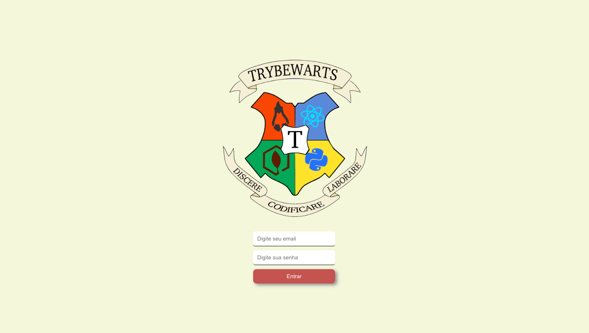
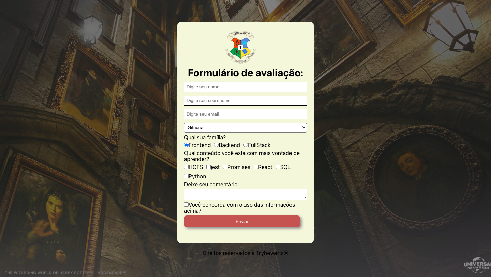
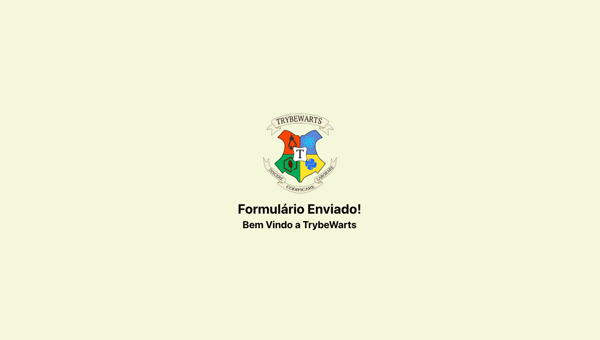

# TrybeWarts

TrybeWarts is a project made only for study porpuse for practice some form in react. this application has:

- login page;
- form page;
- send page, for feedback;

<div align="center" display="inline">



</div>

## Run locally:
- First clone the repository into your machine;

```
git clone git@github.com:GabiNamu/Hogwarts.git
```

- Go to the project directory:
```
cd Hogwarts
```
 
- Install dependencies;

```
npm install
```
- Start the server;
```
npm start
```
## Main technologies used:
- React;
- JavaScript;
- Css;
